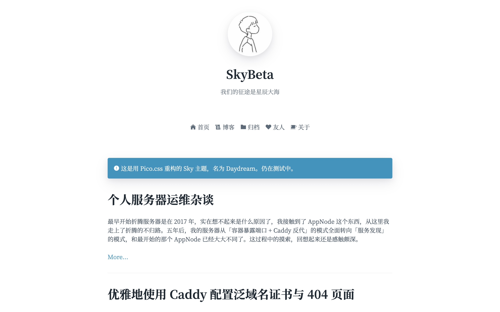

# Daydream ✨

Daydream 是一个简洁轻盈的 Typecho 主题。

Demo：[beta.skywt.cn](https://beta.skywt.cn/)

## 特性 / Features

- 极简单栏设计。精心调校的字体与排版显示，简洁美观。
- 使用 pico.css 重构，轻盈快速。
- 全站 PJAX 无刷新，极速响应。
- 支持显示文章头图、显示发布地点、页面重定向、导航栏显示小图标等适合作为个人博客的功能。
- 集成图片灯箱，代码高亮，KaTeX 数学公式，TOC，暗色模式，评论 UA、归属地显示，字数统计等一大堆功能，all-in-one。

## 安装 / Installation

克隆或下载 master 分支下的代码，将文件夹命名为 Daydream（注意首字母大写），并移动到 Typecho 主题目录，在 Typecho 后台启用主题。

也可以前往 Releases 下载源代码压缩包，解压后将文件夹重命名为 Daydream（注意首字母大写），并移动到 Typecho 主题目录，在 Typecho 后台启用主题。

在使用本主题时，**请勿移除网页底部的署名链接**。移除版权声明是违反 GPL 3.0 协议的。请尊重他人的劳动成果。

## 使用 / Usage

**请在 Typecho 后台的「设置」-「评论」-「评论提交」中取消勾选「开启反垃圾保护」，否则将无法正常发表评论**。关闭该选项后，Typecho 评论区将会关闭反 CSRF 防护，建议结合其他反垃圾评论策略或插件。

建议在「控制台」-「外观」-「设置外观」中进行主题的相关设置。

### 关于「文章摘要」

请在文章中手动插入 `<!--more-->` 标签，或者使用 Typecho 自带文章编辑器里的「摘要分隔线」按钮插入。

一篇文章中，`<!--more-->` 之前的部分会被视为摘要，在博客文章列表页面，每篇文章只展示标题、摘要和「阅读更多」链接（引向全文）。这是源于 WordPress 的做法。如果不添加此标签，则文章列表页面中，每篇文章都会显示全文。

### 关于站点图标

网站在浏览器标签页上显示的小图标，是主题目录下的 favicon.ico 这一文件（并不是「设置外观」中的「站点 LOGO 地址」）。请在安装主题后，自行替换该图标文件为自己的图标。

此外，该图标可能会被浏览器缓存，如果替换文件后刷新网站没有生效，请尝试清空浏览器缓存后再刷新。

### 关于 KaTeX

本主题支持 KaTeX 渲染数学公式。遵从常规的 Markdown 写法，在写作中一对单个美元符号 `$` 中的是行内公式，一对两个美元符号 `$$` 中的是单行公式。

### 关于暗黑模式（Darkmode）

本主题支持暗黑模式。在暗黑模式下，背景会显示为暗色，文字会显示为白色（这是 pico.css 提供的特性）。

暗黑模式的开关跟随浏览器的设置，没有提供手动调整的按钮。（主要是很难在不破坏主题简洁性的情况下设计这样一个单独的按钮。如有创意欢迎沟通。）

### 关于评论区的头像

评论区的头像根据评论者的邮箱获取。规则如下：

- 如果评论者使用包含 QQ 号的 QQ 邮箱，则会尝试获取 QQ 头像；
- 否则，尝试根据邮箱获取 Gravatar 头像（使用 Gravatar 的国内镜像）；
- 否则，使用默认头像。

### 兼容性建议

- 主题已引用 jQuery，插件无需再次引用。
- 集成了 KaTeX ，不建议使用其他数学公式插件。
- 集成了 Highlight.js，不建议使用其他代码高亮插件。
- 集成了 jQuery Fancybox 图片灯箱功能，不建议使用其他图片灯箱类插件。
- 自带了生成文章目录（Table of Contents）的代码，不建议使用其他 TOC 插件。
- 自带了显示评论 UA 和 IP 归属地的功能，不需要使用与此相关的插件。
- 默认支持 Darkmode，不建议使用其他启用 Darkmode 插件。

### 已知问题

- 由于 Safari 浏览器的兼容性问题，点击文章目录（TOC）的链接时，无法平滑跳转，并且跳转到的位置有一定偏移。
- 对于「密码保护」的页面或文章，输入密码的 UI 没有优化，所以非常丑。我自己用不到这个功能，欢迎 PR。
- 不考虑支持 IE 浏览器。

## 协议 / License

本主题使用 [GNU GPL v3](https://choosealicense.com/licenses/gpl-3.0/) 协议。

在使用本主题时，**请勿移除网页底部的署名链接**。移除版权声明是违反 GPL 3.0 协议的。请尊重他人的劳动成果。